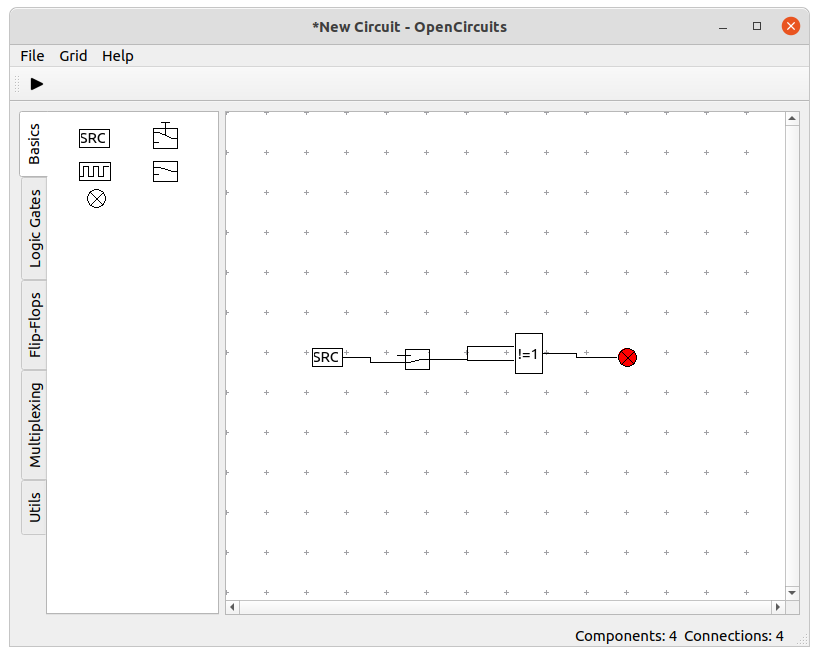

# OpenCircuits
OpenCircuits allows you to plan and simulate digital circuits in an easy-to-understand interface. See [the wiki](https://github.com/CubicVoxel/opencircuits/wiki) for more information.

This is the FORKED repository of [OpenCircuits](https://github.com/yuri-becker/opencircuits)

